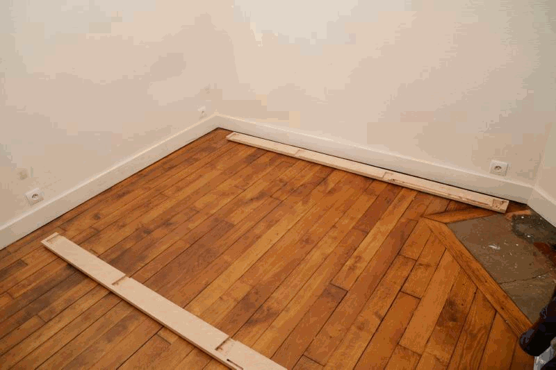
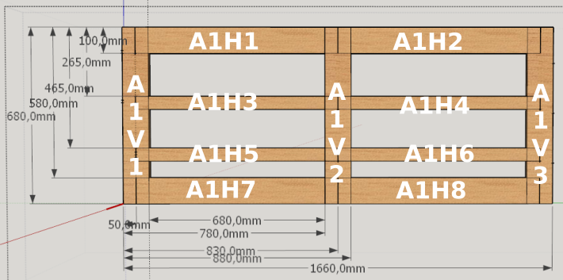
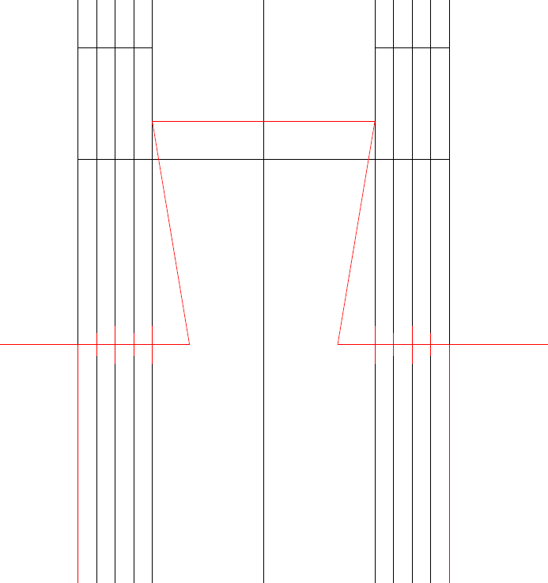

# Modern captain bed #

## Presentation ##

This is a re-design of captain bed in a modern fashion.

The main design ideas :
 - a nice wooden bed inspired by nautical captain bed
 - massive amount of storage (about 2 m3!)
 - Massive wood, traditionnal joinery for strength and durability
 - fully dismountable into small pieces (one person carry)
 - Can be build with reasonnably common tools/
 
 
warning : the original design documents are in french, I translated the essential parts

Here is a detailed presentation of this moder captain bed project.

[Introductory presentation to the modern captain bed project](./presentation/modern_captain_bed_overall_presentation.pdf) ([French version](./presentation/modern_captain_bed_overall_presentation_LQ_fr.pdf))

## 3D model
A conceptual 3D model, simplified (no joinery, no handles, simplified textures, etc.)

**click on 3D model to change view**

<iframe width="800" height="600" src="https://sketchfab.com/models/c7bc11224e4042eab323be94998c2b65/embed" frameborder="0" allowvr allowfullscreen mozallowfullscreen="true" webkitallowfullscreen="true" onmousewheel=""></iframe>

    <a href="https://sketchfab.com/models/c7bc11224e4042eab323be94998c2b65?utm_medium=embed&utm_source=website&utm_campain=share-popup" target="_blank" style="font-weight: bold; color: #1CAAD9;">Modern Captain Bed</a>
    by <a href="https://sketchfab.com/RCura?utm_medium=embed&utm_source=website&utm_campain=share-popup" target="_blank" style="font-weight: bold; color: #1CAAD9;">RCura</a>
    on <a href="https://sketchfab.com?utm_medium=embed&utm_source=website&utm_campain=share-popup" target="_blank" style="font-weight: bold; color: #1CAAD9;">Sketchfab</a>

 
[Go to `3D_model` for 3D model !](./3D_model/modern_captain_bed.dae)

## Design
The design took several months as the project is mechanically complex to solve with traditionnal joinery wihtout loosing storage space.
Moreover, the dissassembled bed has to be easy to move and store.

**Clik on image to see other images**

The gallery of pictures for design contains many pictures about the design step.

The most recent version of the project design dimension are :

**Clik on image to see other images**
[.JPG)](./images/overal_dimension/Gallery.html)

## Building
The project was built in 6 months using evenings and week ends.
Overall, the project can be completed with common woodworking tools.
Mixing power tool and hand tool is also possible.

**clik on image to see other images**
 
The gallery contains some pictures of the build process.

### build-book
Beside the 3D model, the [build book](./building/build_book/modern_captain_bed_build_book.pdf) contains illustrated parts, nomenclature and measurements.

**clik on image to see other images**
.

### template
Some joins are duplicated heavily, which make them lenghty to draw on wood.
We propose numerical templates to be used with router or  similar tools.

## Assembly##
The main design advantage of this bed is the traditionnal joinery that allows full assembly / disassembly.
### Pictures of assembly
As shown in the assembly galleries, assembling bed is straightforward.

**clik on image to see other images**
[.JPG)](./images/bed_home_assembly/Gallery.html)

**clik on image to see other images**
[.JPG)](./images/bed_at_woodshop/Gallery.html)

### Moving the bed
The bed can be dissassembled into small parts, such that no part is longuer than 2 meters, larger than 40 cm, and of more than 10 cm of thickness.

**clik on image to see other images**
[.JPG)](./images/bed_home_moving/Gallery.html)

