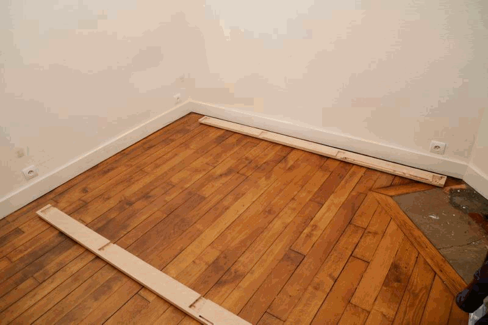

# Modern captain bed #

## Presentation ##

This is a re-design of captain bed in a modern fashion.

The main design ideas :
 - a nice wooden bed inspired by nautical captain bed
 - massive amount of storage (about 2 m3!)
 - Massive wood, traditionnal joinery for strength and durability
 - fully dismountable into small pieces (one person carry)
 - Can be build with reasonnably common tools/
 
 
warning : the original design documents are in french, I translated the essential parts

Here is a detailed presentation of this moder captain bed project.

[Introductory presentation to the modern captain bed project](./presentation/modern_captain_bed_overall_presentation.pdf)

[French version](./presentation/modern_captain_bed_overall_presentation_LQ_fr.pdf)

## 3D model
A conceptual 3D model, simplified (no joinery, no handles, simplified textures, etc.)

<iframe width="800" height="600" src="https://sketchfab.com/models/c7bc11224e4042eab323be94998c2b65/embed" frameborder="0" allowvr allowfullscreen mozallowfullscreen="true" webkitallowfullscreen="true" onmousewheel=""></iframe>

    <a href="https://sketchfab.com/models/c7bc11224e4042eab323be94998c2b65?utm_medium=embed&utm_source=website&utm_campain=share-popup" target="_blank" style="font-weight: bold; color: #1CAAD9;">Modern Captain Bed</a>
    by <a href="https://sketchfab.com/RCura?utm_medium=embed&utm_source=website&utm_campain=share-popup" target="_blank" style="font-weight: bold; color: #1CAAD9;">RCura</a>
    on <a href="https://sketchfab.com?utm_medium=embed&utm_source=website&utm_campain=share-popup" target="_blank" style="font-weight: bold; color: #1CAAD9;">Sketchfab</a>

link to 3D file
[Go to `3D_model` for 3D model !](./3D_model/modern_captain_bed.dae)

## Design

## Building
### build-book
### template

## Assembly##
(in french)
 
